# Entity UML Schema

This document defines the storage entity schema for the Views system using Mermaid.js class diagrams.

## Quick Reference

### Entity Hierarchy
```
Node ←──1:1──► Reference ──*:1──► Component
```

### ID Naming Convention
| Entity | Primary Key | Type | Storage |
|--------|-------------|------|---------|
| Node | `node_id` | NodeId | `nodes/{id}.json` |
| Reference | `ref_id` | RefId | `references/{id}.json` |
| Component | `comp_id` | CompId | `components/{Type}/{id}.json` |
| NavBar | `nav_bar_id` | NavBarId | `settings/navbar/{id}.json` |
| Footer | `footer_id` | FooterId | `settings/footer/{id}.json` |
| Theme | `theme_id` | ThemeId | `settings/themes/{id}.json` |
| Tag | `tag_id` | TagId | `tags/{id}.json` |

### Class Definition Styles
| Style | Color | Meaning |
|-------|-------|---------|
| `:::hasId` | Blue | Entity has its own table/directory |
| `:::isInstance` | Orange | Singleton instance (one file) |
| `:::noTable` | Green | Embedded object, stored inline |

### Relationship Notation
| Notation | Meaning | Implementation |
|----------|---------|----------------|
| `A *-- B` | **Composition** | A owns B; delete A = delete B |
| `A o-- B` | **Aggregation** | A references B; B exists independently |
| `A <\|-- B` | **Inheritance** | B extends A; requires `type` + `config` |

---

## Conceptual Model

A **View** is represented as:
- A **Node** (the root node for this view)
- Which has a **Reference**
- Which points to a **ViewContainer**
- The ViewContainer's children are accessed via `container.child_node`

```
┌─────────────────────────────────────────────────────────────┐
│  VIEW STRUCTURE (e.g., /about page)                         │
├─────────────────────────────────────────────────────────────┤
│                                                              │
│  Node (root)                                                 │
│  ├── node_id: 1001                                          │
│  ├── ref_id: 2001 ──────► Reference                         │
│  │                        ├── ref_id: 2001                  │
│  │                        ├── node_id: 1001                 │
│  │                        └── comp_id: 3001 ──► ViewContainer│
│  │                                              ├── comp_id: 3001
│  │                                              ├── type: "ViewContainer"
│  │                                              ├── config.path: "/about"
│  │                                              ├── config.title: "About"
│  │                                              └── config.child_node: 1002
│  │                                                              │
│  └───────────────────────────────────────────────────────────────┘
│                                                                  │
│  Child linked-list (starts at ViewContainer.child_node):         │
│                                                                  │
│  Node (Title)                                                    │
│  ├── node_id: 1002                                               │
│  ├── ref_id: 2002                                                │
│  ├── parent_node: 1001                                           │
│  ├── previous_node: null                                         │
│  └── next_node: 1003 ──► Node (Markdown)                         │
│                          ├── node_id: 1003                       │
│                          ├── parent_node: 1001                   │
│                          ├── previous_node: 1002                 │
│                          └── next_node: null                     │
│                                                                  │
└─────────────────────────────────────────────────────────────┘
```

---

## Class Diagram

```mermaid
classDiagram
    direction TB



    %% ============ CLASS DECLARATIONS ============

    class Node:::hasId
    class Reference:::hasId
    class Component:::hasId
    class Container
    class ViewContainer
    class ListContainer
    class InlineContainer
    class StyleContainer
    class UnitComponent
    class SectionUnit
    class PlainTextUnit
    class AlertUnit
    class MarkdownUnit
    class LinkUnit
    class MediaUnit
    class ImageMedia
    class VideoMedia
    class PDFMedia
    class ExperienceComponent
    class TagListComponent
    class HtmlComponent
    class JsComponent
    class BasicLink:::noTable
    class InternalLink
    class ExternalLink
    class Settings:::isInstance
    class SiteConfig:::isInstance
    class NavBar:::hasId
    class Footer:::hasId
    class Theme:::hasId
    class Tag:::hasId

    %% ============ NODE ============

    Node : +created_at string
    Node : +updated_at string

    
    Node "1" *-- "1" Reference : ref_id
    Node "0..*" o-- "0..1" Node : parent_node
    Node "0..1" o-- "0..1" Node : previous_node
    Node "0..1" o-- "0..1" Node : next_node

    %% ============ REFERENCE ============

    Reference : +overrides Record?
    Reference : +created_at string
    Reference : +updated_at string

    Reference "1" o-- "1" Node : node_id
    Reference "0..*" o-- "1" Component : comp_id

    %% ============ COMPONENT (ABSTRACT) ============

    class Component {
        <<abstract>>
    }
    Component : +type ComponentType
    Component : +reference_count number
    Component : +created_at string
    Component : +updated_at string

    Component <|-- Container
    Component <|-- UnitComponent
    Component <|-- ExperienceComponent
    Component <|-- TagListComponent
    Component <|-- HtmlComponent
    Component <|-- JsComponent

    %% ============ CONTAINER (ABSTRACT) ============

    class Container {
        <<abstract>>
    }
    Container : +type ContainerType

    Container "1" o-- "0..1" Node : child_node
    Container <|-- ViewContainer
    Container <|-- ListContainer
    Container <|-- InlineContainer
    Container <|-- StyleContainer

    %% ============ VIEW CONTAINER ============

    ViewContainer : +path string
    ViewContainer : +name string
    ViewContainer : +title string
    ViewContainer : +browser_title string
    ViewContainer : +description string?
    ViewContainer : +tag_ids TagId[]

    %% ============ LIST CONTAINER ============

    ListContainer : +listType ListItemType
    ListContainer : +displayMode DisplayMode
    ListContainer : +name string?

    %% ============ INLINE CONTAINER ============

    %% ============ STYLE CONTAINER ============

    StyleContainer : +isTransparent bool

    %% ============ UNIT COMPONENT (ABSTRACT) ============

    class UnitComponent {
        <<abstract>>
    }

    UnitComponent <|-- SectionUnit
    UnitComponent <|-- PlainTextUnit
    UnitComponent <|-- AlertUnit
    UnitComponent <|-- MarkdownUnit
    UnitComponent <|-- LinkUnit
    UnitComponent <|-- MediaUnit

    %% ============ SECTION UNIT ============

    SectionUnit : +text string
    SectionUnit : +level HeadingLevel?

    %% ============ PLAIN TEXT UNIT ============

    PlainTextUnit : +text string

    %% ============ ALERT UNIT ============

    AlertUnit : +content string
    AlertUnit : +variant AlertVariant

    %% ============ MARKDOWN UNIT ============

    MarkdownUnit : +content string

    %% ============ LINK UNIT ============

    LinkUnit "1" *-- "1" BasicLink : basic_link_id

    %% ============ MEDIA UNIT (ABSTRACT) ============

    class MediaUnit {
        <<abstract>>
    }
    MediaUnit : +src InternalPath

    MediaUnit <|-- ImageMedia
    MediaUnit <|-- VideoMedia
    MediaUnit <|-- PDFMedia

    %% ============ IMAGE MEDIA ============

    ImageMedia : +alt string?

    %% ============ VIDEO MEDIA ============

    VideoMedia : +autoplay boolean?

    %% ============ PDF MEDIA ============

    PDFMedia : +title string?

    %% ============ EXPERIENCE COMPONENT ============

    ExperienceComponent : +position string
    ExperienceComponent : +company string
    ExperienceComponent : +start_date string
    ExperienceComponent : +end_date string
    ExperienceComponent : +image string
    ExperienceComponent : +content string

    %% ============ TAG LIST COMPONENT ============

    TagListComponent : +sourceType TagSource

    %% ============ HTML COMPONENT ============

    class HtmlComponent {
        <<NOT IMPLEMENTING YET>>
    }

    %% ============ JS COMPONENT ============

    class JsComponent {
        <<NOT IMPLEMENTING YET>>
    }

    %% ============ BASIC LINK (ABSTRACT) ============

    class BasicLink {
        <<abstract>>
    }
    BasicLink : +basic_link_id BasicLinkId [PK]
    BasicLink : +label string
    BasicLink : +icon string?

    BasicLink <|-- InternalLink
    BasicLink <|-- ExternalLink

    %% ============ INTERNAL LINK ============

    InternalLink "1" o-- "1" Node : view_node_id
    InternalLink "1" o-- "0..1" Node : section_node_id

    %% ============ EXTERNAL LINK ============

    ExternalLink : +url string

    %% ============ SITE CONFIG ============

    SiteConfig : +site_name string

    SiteConfig "1" o-- "0..1" InternalLink : default_home_link_id

    %% ============ NAV BAR ============

    NavBar : +position Position
    NavBar : +order number

    NavBar "0..1" o-- "0..1" InternalLink : internal_link_id

    %% ============ FOOTER ============

    Footer : +position Position
    Footer : +order number

    Footer "0..1" o-- "0..1" InternalLink : internal_link_id

    %% ============ THEME ============

    Theme : +name string
    Theme : +color_scheme ColorScheme

    %% ============ SETTINGS ============

    Settings "1" o-- "0..*" Theme : theme_ids
    Settings "1" o-- "0..1" Theme : active_theme_id
    Settings "1" o-- "0..*" Node : view_node_ids
    Settings "1" *-- "1" SiteConfig : site_config
    Settings "1" o-- "0..*" NavBar : nav_bar_ids
    Settings "1" o-- "0..*" Footer : footer_ids

    %% ============ TAG ============

    Tag : +label string

    ViewContainer "0..*" o-- "0..*" Tag

    classDef hasId fill:#e1f5fe,stroke:#01579b,stroke-width:3px
    classDef isInstance fill:#fff3e0,stroke:#e65100,stroke-width:3px
    classDef noTable fill:#e8f5e9,stroke:#2e7d32,stroke-width:3px
```



## Notes

### Inheritance Relationship (`A <|-- B`)

When class B inherits from abstract class A:

1. **Base class has `type` field** - Discriminator to identify derived type
2. **Derived class data in `config`** - All subclass-specific fields go in config object
3. **Storage by type** - Files stored in `{entity}/{Type}/{id}.json`

**Example:**
```json
{
  "comp_id": 12345,
  "type": "ViewContainer",
  "config": {
    "path": "/about",
    "title": "About Us",
    "tag_ids": [101, 102]
  },
  "reference_count": 1
}
```

### Composition Relationship (`A *-- B`)

When A composes B (A owns B):

1. **A stores B's ID** - Foreign key field pointing to B
2. **Lifecycle coupling** - Deleting A should delete B
3. **B cannot exist without A** - B has no independent meaning

**Example:** `Node *-- Reference`
- Node owns its Reference
- Delete Node = delete its Reference
- Reference cannot exist without Node

### Aggregation Relationship (`A o-- B`)

When A aggregates B (A references B):

1. **A stores B's ID** - Foreign key field pointing to B
2. **Independent lifecycles** - B exists independently of A
3. **Reference only** - A just points to B, doesn't own it

**Example:** `Settings o-- Theme`
- Settings references Themes
- Themes exist independently
- Delete Settings ≠ delete Themes

## Type Definitions

### Path Types

| Type | Base Type | Description |
|------|-----------|-------------|
| `InternalPath` | `string` | Internal URL path (e.g., `/images/logo.png`) |
| `ExternalPath` | `string` | External URL (e.g., `https://example.com`) |
| `Path` | `InternalPath \| ExternalPath` | Union of internal or external paths |

### ID Types

All IDs are unsigned 32-bit integers generated randomly.

| Type | Base Type | Description |
|------|-----------|-------------|
| `UniqueId` | `unsigned integer` | Base type for all entity IDs |
| `NodeId` | `UniqueId` | Node entity identifier |
| `RefId` | `UniqueId` | Reference entity identifier |
| `CompId` | `UniqueId` | Component entity identifier |
| `ThemeId` | `UniqueId` | Theme identifier |
| `TagId` | `UniqueId` | Tag entity identifier |
| `NavBarId` | `UniqueId` | NavBar entity identifier |
| `FooterId` | `UniqueId` | Footer entity identifier |

### Discriminator Types

```typescript
// Component type discriminator
type ComponentType =
  | 'ViewContainer' | 'ListContainer' | 'InlineContainer' | 'StyleContainer'  // Containers
  | 'SectionUnit' | 'PlainTextUnit' | 'AlertUnit' | 'MarkdownUnit' | 'LinkUnit'  // Units
  | 'ImageMedia' | 'VideoMedia' | 'PDFMedia'  // Media
  | 'ExperienceComponent' | 'TagListComponent'  // Leaf
  | 'HtmlComponent' | 'JsComponent';  // Future

// Container type discriminator
type ContainerType = 'ViewContainer' | 'ListContainer' | 'InlineContainer' | 'StyleContainer';

// Link type discriminator
type LinkType = 'InternalLink' | 'ExternalLink';
```

### Other Types

```typescript
type ListItemType = 'View' | 'Tag';

type DisplayMode = 'list' | 'grid' | 'cards';

type HeadingLevel = 'h1' | 'h2' | 'h3';

type AlertVariant = 'info' | 'warning' | 'error' | 'success';

type ColorScheme = 'system' | 'light' | 'dark';

type Position = 'left' | 'right';
```

---

## Generating Diagrams

To generate an SVG diagram from this schema:

```bash
npm run generate:schema
```

This will create `docs/diagrams/entity-schema.svg`.
